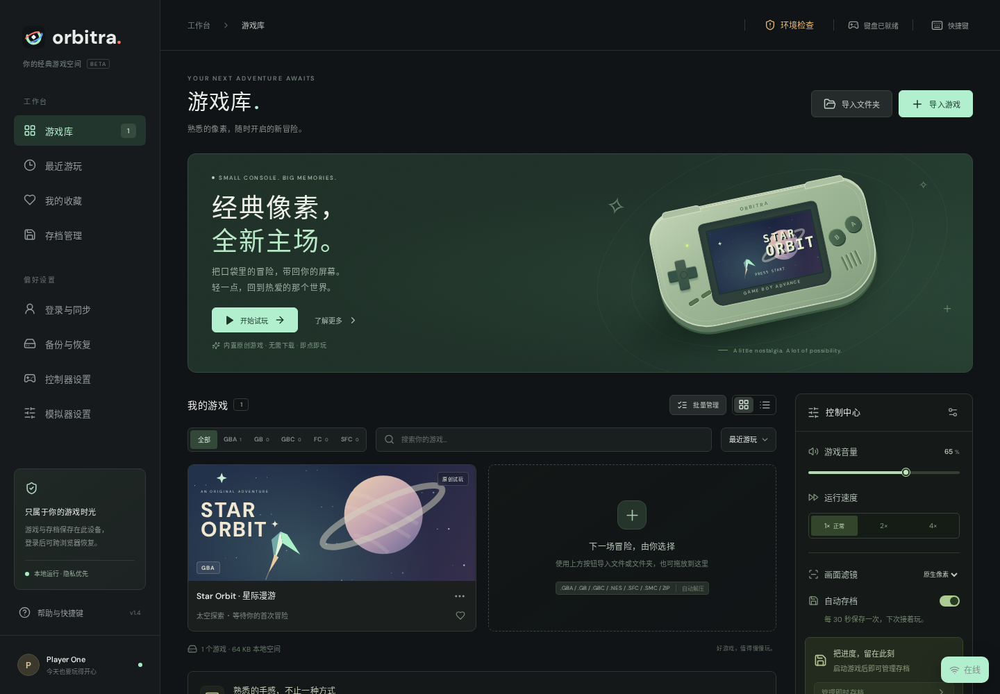
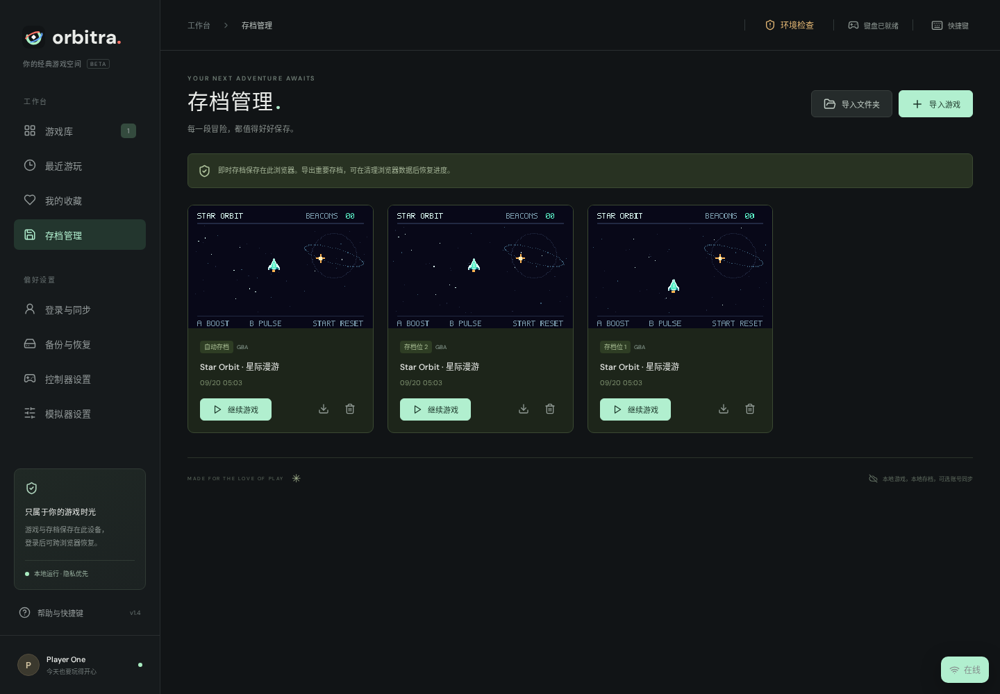
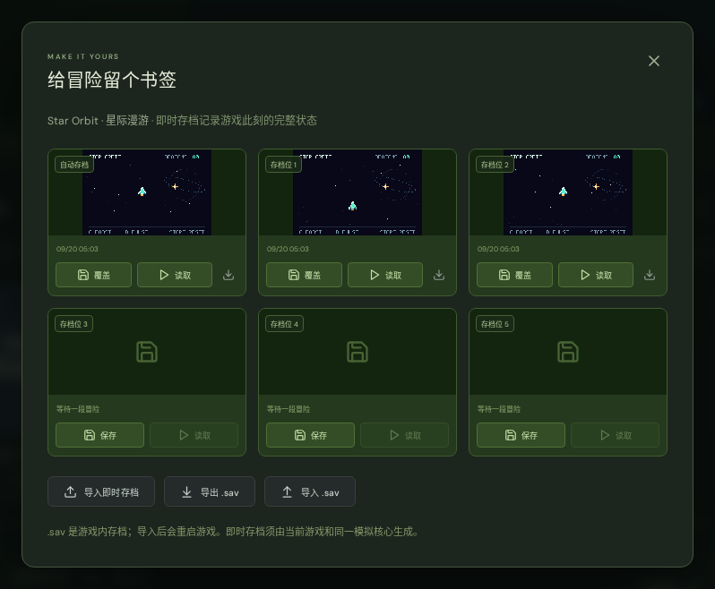
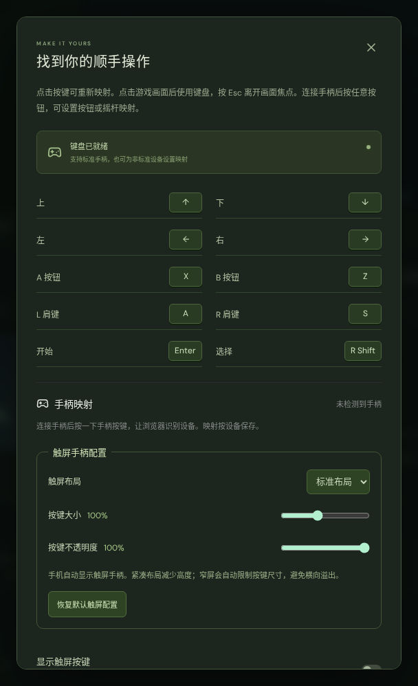
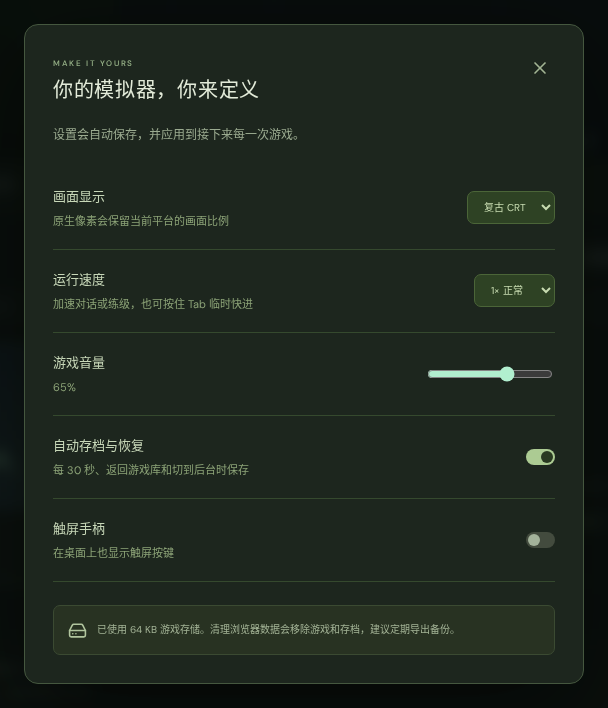
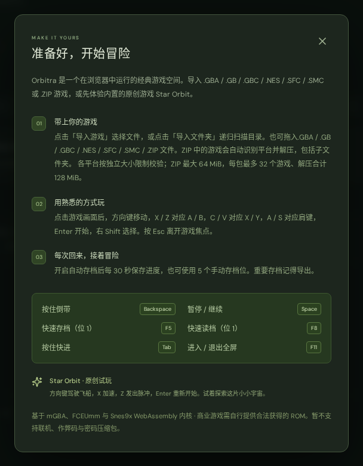
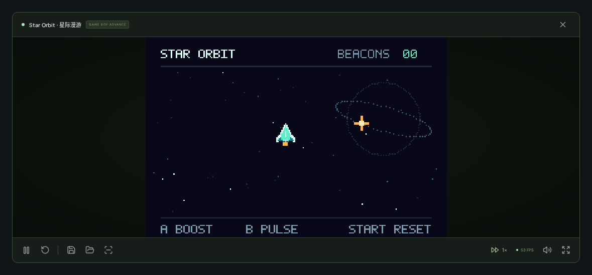
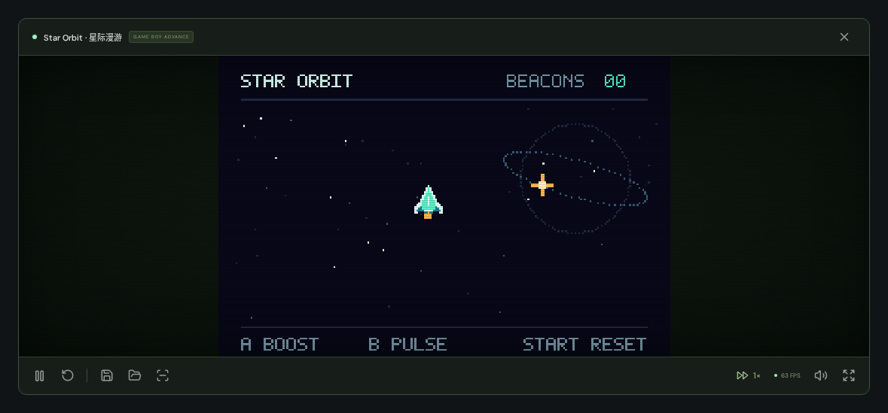
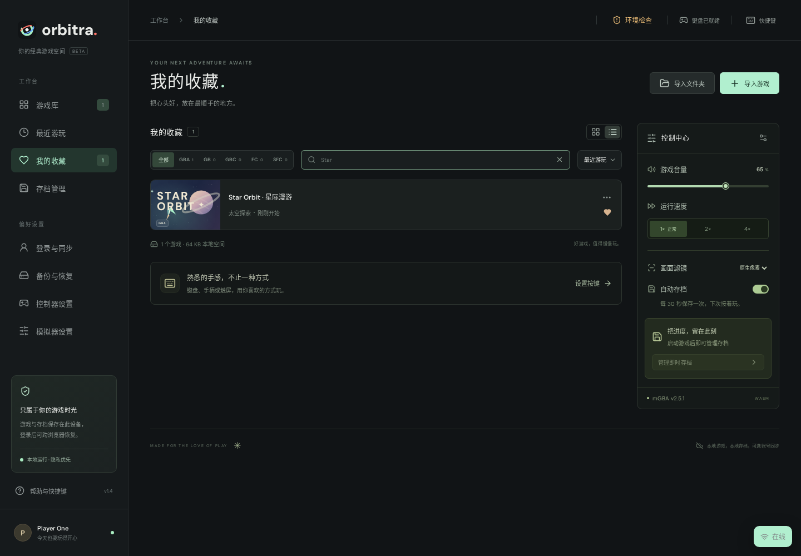
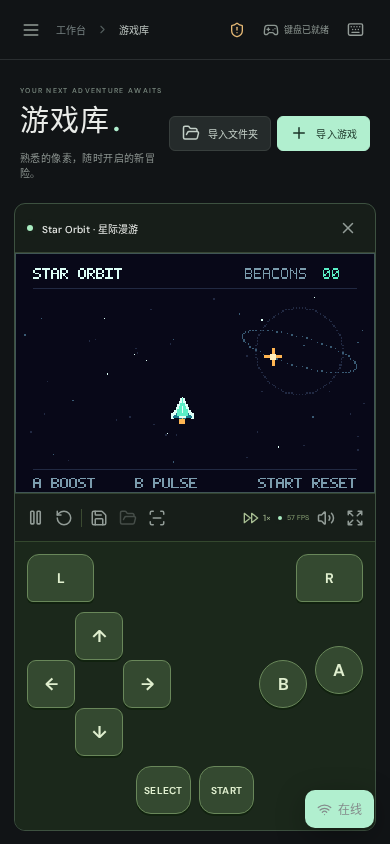

<div align="center">


# Orbitra

**Every era, one orbit.**

Orbitra is a local-first browser emulator for retro games: GBA (Game Boy Advance), Game Boy, Game Boy Color, NES, SNES, and experimental GameCube emulation. It is powered by local WebAssembly cores and a unified game library for ROMs, save states, gamepad input, and touch controls.

[](LICENSE)
[](THIRD_PARTY_NOTICES.md)
[](https://react.dev/)
[](https://www.typescriptlang.org/)

[简体中文](README.zh-CN.md) · [Features](#features) · [Quick start](#quick-start) · [Deployment](#deployment) · [Brand assets](docs/brand.md) · [Roadmap](ROADMAP.md) · [Contributing](CONTRIBUTING.md)

</div>



Orbitra brings classic systems from different eras into one browser experience, combining a local game library, save states and keyboard, gamepad and touch controls. The interface is currently in Chinese and adapts to desktop, tablet and phone screens. Bundled mGBA, FCEUmm, Snes9x, and experimental Dolphin cores run the supported systems locally.

No account or user-supplied BIOS is required. You can optionally configure the address of a separately deployed online game library, sign in, and sync classic-system ROMs and saves across browsers. The online library is not the game runtime, Orbitra never sends data to the current site by default, and GameCube disc images always remain in the browser where they were imported. Try **Star Orbit**, an original, MIT-licensed homebrew game included in the repository. No commercial game ROMs are distributed with this project.

## Screenshots

All screenshots show the real application. Game footage comes from the included original homebrew ROM. Alongside the library overview above, the gallery covers saves, controls, settings, help and mobile play.

### 1. Save manager and save states

The save manager collects automatic and manual states across games, with screenshot previews, timestamps and actions to resume, export or delete a state.



The in-game save panel provides **one automatic slot and five manual slots**. Save, load, import and export states, or back up and import a game's battery save (`.sav`).

<p align="center">
  <a href="docs/images/save-states.png"></a>
</p>

### 2. Controller and emulator settings

|                                                          Controller settings                                                           |                                                       Emulator settings                                                       |
| :------------------------------------------------------------------------------------------------------------------------------------: | :---------------------------------------------------------------------------------------------------------------------------: |
|  |  |
|         Configure keyboard and gamepad mappings, stick deadzone, touch layout, size and opacity; restore defaults when needed.         |          Choose display style, 1× / 2× / 4× speed, volume and automatic saves. Preferences are saved automatically.           |

### 3. Help and keyboard shortcuts

The built-in guide explains supported ROM and ZIP imports, keyboard controls and saves, with a quick reference for pause, quick save/load, fast-forward, rewind and fullscreen.

<p align="center">
  <a href="docs/images/help-shortcuts.png"></a>
</p>

### 4. Gameplay and display styles

|                                          Native pixels                                           |                                       Retro CRT                                       |
| :----------------------------------------------------------------------------------------------: | :-----------------------------------------------------------------------------------: |
|  |  |
|    Playback, quick save/load, speed, screenshot and fullscreen controls sit below the screen.    |    Switch to CRT scanlines in settings, or choose native pixels or smooth scaling.    |

### 5. Favorites and library list

Keep favorite games together. List view shows game details and play history, with search, sorting and launch controls available.



### 6. Mobile touch controls

The mobile layout exposes platform-specific controls, including X / Y / L / R for SFC games, alongside an accessible playback toolbar. Choose standard or compact layouts and adjust button size and opacity. Multiple fingers can hold buttons simultaneously; changing orientation releases held inputs.

<p align="center">
  <a href="docs/images/mobile-player.png"></a>
</p>

## Features

- **Portable backups:** choose games and optionally include ROMs in a versioned ZIP with SHA-256 checksums. Preview before restoring, match missing ROMs by content, select individual conflicts, and roll back the entire restore on failure. Existing progress is kept by default; unknown or different-core states are unchecked.
- **Real emulation:** bundled mGBA, FCEUmm, Snes9x, and experimental Dolphin WebAssembly cores support Game Boy Advance (GBA), Game Boy (GB), Game Boy Color (GBC), Nintendo Entertainment System (NES), Super Nintendo (SNES), and GameCube.
- **Local library:** file imports, recursive folder scanning and drag-and-drop, platform filters, search, sorting, favorites, play history, grid and list views, current-result selection and batch deletion.
- **ZIP support:** import supported ROMs from nested folders, with platform-scoped SHA-256 deduplication that preserves progress without sharing saves across platforms.
- **Save states:** five manual slots and one automatic slot, screenshot previews, quick save/load and import/export.
- **Progress management:** automatic states every 30 seconds and when returning to the library or hiding the page, when enabled; `.sav` import/export.
- **Playback:** pause, resume, reset, fullscreen, 1× / 2× / 4× speed, hold-to-fast-forward, hold-to-rewind, volume and mute.
- **Controls:** remappable keyboard; device-specific gamepad button / axis mappings and deadzone; standard / compact touch layouts with adjustable size and opacity.
- **Display:** platform-native aspect ratios, WebGL 2 with an automatic Canvas 2D software fallback, pixel, smooth and CRT scanline filters, and real-core screenshots.
- **Local data and online library:** IndexedDB stores ROMs, library metadata and saves; localStorage stores preferences. An optional, separately hosted online library syncs ROMs and saves so a fresh browser can restore them. Runtime assets are bundled without an external CDN dependency.
- **Homebrew demo:** reproducible ARM code with double-buffered graphics, native input, PSG audio and SRAM saves.

## Quick start

Recommended: **Node.js 24** and **pnpm 11.19.0**. Minimum Node.js version: 22.18. If pnpm is not installed, run `npm install --global pnpm@11.19.0` first.

```sh
git clone https://github.com/hehuang139/orbitra.git
cd orbitra
pnpm install --frozen-lockfile
pnpm dev
```

Open [http://localhost:5173](http://localhost:5173). Click **「开始试玩」** to start the demo, import your own `.gba`, `.gb`, `.gbc`, `.nes`, `.sfc`, `.smc`, `.iso`, `.gcm`, or `.zip` file, or select a folder to scan its subdirectories recursively. GameCube currently requires a cross-origin-isolated desktop Chromium environment with OffscreenCanvas and roughly 1.5 GiB of memory.

In Star Orbit, move toward the gold beacons to collect points. Hold `X` to boost, press `Z` to emit a pulse, and press `Enter` to reset. See the [demo documentation](public/demo/README.md) for its source and build instructions.

## Controls

Launching a game focuses its screen; clicking the screen restores that focus. Gameplay keys and shortcuts apply only while the screen is focused. Use `Esc` or `Shift + Tab` to leave it, then navigate the interface with normal `Tab`, `Enter` and `Space` behavior. Closing a dialog restores its trigger's focus, and exiting a game restores the launch control. Change emulated-button mappings in controller settings and press `Esc` to cancel capture. Emulator shortcuts remain reserved.

| Action                    | Default key             |
| ------------------------- | ----------------------- |
| D-pad                     | Arrow keys              |
| A / B                     | `X` / `Z`               |
| X / Y (SFC only)          | `C` / `V`               |
| L / R (GBA and SFC)       | `A` / `S`               |
| Start / Select            | `Enter` / Right `Shift` |
| Pause / resume            | `Space`                 |
| Save / load manual slot 1 | `F5` / `F8`             |
| Temporary 2× speed        | Hold `Tab`              |
| Rewind                    | Hold `Backspace`        |
| Fullscreen                | `F11`                   |

Standard gamepads retain default face / shoulder / menu buttons, D-pad and left-stick mappings; the UI hides buttons that the active platform does not use. Press a gamepad button once to make it visible to the browser. In controller settings, select the device, choose an emulated button, then press a physical button or move an axis. Capture can be cancelled, individual mappings cleared and defaults restored. Stick deadzone ranges from 10% to 90%. Nonstandard devices start with no guessed mappings. Profiles persist by browser-provided device identity and layout, independent of connection slot; devices with the same identity and layout share a profile.

Touch settings offer standard / compact layouts, 80%–130% button size and 40%–100% opacity. Settings persist across reloads and older preferences receive safe defaults. Narrow screens constrain actual button size, and styles reserve safe-area spacing. Disconnection, blur, dialogs, pointer cancellation and pause release the relevant input. A key held by several input sources remains pressed until every source releases it. Physical phone, controller and assistive-technology coverage is documented in the [compatibility record](docs/compatibility-matrix.md).

## Import and save limits

Single `.gba` files must be between 192 bytes and 32 MiB; `.gb` and `.gbc` files between 32 KiB and 8 MiB; `.nes` files between 16 KiB + 16 bytes and 8 MiB with an iNES header; and `.sfc` / `.smc` files between 32 KiB and 16 MiB. GameCube `.iso` / `.gcm` images are header-checked, stored as IndexedDB blobs, and must be imported directly rather than from ZIP. ZIP files may be up to 64 MiB, contain up to 32 games and expand to at most 128 MiB of ROM data. Stored and Deflate compression are supported; encrypted, ZIP64, split and nested ZIP archives are not.

Battery saves (`.sav`) contain a game's own saved progress. Save states capture the full emulation state and require the matching game, platform and compatible core version. Clearing site data, ending an incognito session or browser storage eviction can delete unsynced local files. Sign in or export important saves so they can be restored in a new browser. Force-closing the browser can lose progress since the last automatic save or sync.

The adapter waits for the current game's first completed frame before allowing save operations. Battery export reads live cartridge save data from a native state snapshot, avoiding stale SRAM when the core has not yet flushed its virtual filesystem. This change does not upgrade the bundled mGBA core or change public `.sav` / save-state formats.

## Deployment

### Docker image

Install Docker and the Docker Compose plugin, then run from the repository root:

```sh
docker compose up -d --build
```

Open [http://localhost:8080](http://localhost:8080). `compose.yaml` builds the local `orbitra:local` image and starts the `orbitra` service. To change the host port or stop the service:

```sh
PORT=8090 docker compose up -d --build
docker compose down
```

After changing the port, open [http://localhost:8090](http://localhost:8090). You can also build and run without Compose:

```sh
docker build -t orbitra:local .
docker run -d --name orbitra -p 8080:8080 \
  --read-only --tmpfs /tmp --cap-drop ALL \
  --security-opt no-new-privileges:true --restart unless-stopped \
  orbitra:local
```

The multi-stage build uses Node.js 24 and pnpm 11.19.0. The final image serves only static files through Nginx, running as a non-root user on container port `8080`. Compose enables a read-only filesystem, temporary `/tmp` storage, drops all Linux capabilities, prevents privilege escalation, and uses the `unless-stopped` restart policy.

The image includes cross-origin isolation headers, the `application/wasm` MIME type, SPA route fallback, and a health check (`/healthz` returns `200`). Missing static resources return `404`, not HTML. Only HTTP responses for content-hashed files under `assets/` receive long-lived caching; HTTP responses for entry HTML, the Service Worker, and fixed-path resources such as the emulator core do not. The Service Worker caches core resources with a cache-first strategy. When changing any fixed-path resource, update `public/sw.js` at the same time and increment `CACHE_VERSION` to avoid mixing old and new versions.

For public access, use an HTTPS reverse proxy that forwards the site root to container port `8080` and preserves the image's `Cross-Origin-Opener-Policy` and `Cross-Origin-Embedder-Policy` response headers. Keep the application and core resources on the same origin. Subpath deployment is not recommended, and plain HTTP on a LAN address does not meet the core's requirements.

This Nginx image serves only the static application and does not include the online game library; the full local workflow remains available. No container data volume is needed: the user's browser stores ROMs, library metadata and saves in IndexedDB, and preferences in localStorage. Changing the domain, protocol or port changes the browser storage origin. Export important data through the backup and restore panel before migrating. Run the separate online game library described below when sign-in and cross-browser sync are required.

To distribute a built image offline, export it on the build machine, load it on the target machine, then start it with the `docker run` command above:

```sh
# Build machine
docker save -o orbitra.tar orbitra:local
# Target machine
docker load -i orbitra.tar
```

The following Node HTTP check needs no browser dependencies. Check a running image's headers, WASM MIME type, caching, missing-resource `404` responses, SPA fallback, and health check:

```sh
DEPLOYMENT_TEST_URL=http://127.0.0.1:8080 pnpm test:deployment
```

### Static build and hosting

```sh
pnpm build
pnpm start
```

The output is in `dist/`. `pnpm start` serves only the game runtime at [http://localhost:4173](http://localhost:4173) by default; configure `HOST` and `PORT` as needed. Games, ROMs and saves remain in the browser, and the runtime does not include account or sync APIs.

The runtime can serve HTTPS directly when both `TLS_CERT_PATH` and `TLS_KEY_PATH` point to PEM certificate and private-key files. A LAN IP certificate must contain that IP as a Subject Alternative Name and be trusted by each client device; plain HTTP cannot provide the secure context required by Web Crypto and SharedArrayBuffer.

Run the online game library as a separate service in another terminal:

```sh
ADVANCE_LIBRARY_ALLOWED_ORIGINS=http://localhost:4173 pnpm start:library
```

It listens at [http://localhost:4174](http://localhost:4174) by default. Open “Online game library” in Orbitra and enter that address before signing in. Configure its bind address, port, SQLite directory and comma-separated runtime origin allowlist with `ADVANCE_LIBRARY_HOST`, `ADVANCE_LIBRARY_PORT`, `ADVANCE_LIBRARY_DATA_DIR` and `ADVANCE_LIBRARY_ALLOWED_ORIGINS`. The default database is `.data/online-library/advance.sqlite`. For public deployments, set both `ADVANCE_LIBRARY_TLS_CERT_PATH` and `ADVANCE_LIBRARY_TLS_KEY_PATH`, and back up the data directory.

`pnpm dev`, `pnpm preview` and static hosting serve only the game runtime; none implicitly starts an online library. A single library transfer is capped at 72 MiB and each account at 2 GiB. Server-side data is not end-to-end encrypted. An HTTPS runtime can only connect to an HTTPS library. Session tokens are kept in browser localStorage, so do not sign in on untrusted devices.

**The threaded WASM core requires HTTPS or localhost and cross-origin isolation.** Serve these response headers:

```http
Cross-Origin-Opener-Policy: same-origin
Cross-Origin-Embedder-Policy: require-corp
```

Vite development and preview servers already set them. The included `public/_headers` supports compatible Netlify / Cloudflare Pages deployments. Other hosts must configure the headers explicitly. Serve the core and application from the same origin; the current build assumes a site-root deployment.

Plain HTTP on a LAN address and hosts without the required headers will not run the core. Default GitHub Pages hosting does not support these custom response headers and is not a direct deployment target for this version. Browsers need SharedArrayBuffer, WebAssembly threads, Canvas 2D and IndexedDB. The application prefers WebGL 2 and automatically uses a slower Canvas 2D software renderer when WebGL 2 cannot be created. The production build includes a versioned PWA shell and user-controlled offline cache updates; real mobile installation still needs validation.

## Development and testing

```sh
pnpm test
pnpm test:library-server
pnpm build
pnpm exec playwright install chromium

# Keep pnpm dev running in another terminal
pnpm test:engine
pnpm test:platforms
pnpm test:ui
pnpm test:zip
pnpm test:saves
pnpm test:keyboard
pnpm test:gamepad
pnpm test:touch
pnpm test:library-sync
pnpm test:startup
pnpm test:backup
pnpm test:pwa

# Run against an already-started Docker image
pnpm test:deployment
```

Unit tests cover storage, ZIP imports, environment checks, input ownership, preference migration, gamepad / touch configuration, account API protection and native battery snapshot boundaries and decompression. Browser suites cover real GBA / GB / GBC / FC / SFC core execution, native display ratios, platform filtering, state restoration, rewind, live SRAM, worker cleanup, library / save / backup / account-sync flows, keyboard focus and navigation, synthetic gamepads, touch pointers and narrow / landscape viewports. Startup regression covers failed prerequisites, storage failures, first-frame readiness, timeout and disposal during loading.

Browser tests default to `http://127.0.0.1:5173`; use `ENGINE_TEST_URL` or `UI_TEST_URL` to override it. The engine, gamepad and startup suites require Vite development pages or module instrumentation. `BROWSER_EXECUTABLE_PATH` can select an installed Chromium / Chrome / Edge binary. Synthetic Gamepad API input and mobile viewports do not certify physical controllers, phones, audio quality or screen-reader usability. The generated GB / GBC fixtures cover MBC1 with 8 KiB battery RAM; other mappers, RTC behavior and broad commercial-ROM compatibility remain unverified.

The [contributing guide](CONTRIBUTING.md) describes the project structure and test workflow in more detail. English Issues and PRs are welcome.

## Roadmap and compatibility

Gamepad and touch customization and keyboard focus improvements are implemented. Remaining work includes physical-device and screen-reader verification, broader browser / low-end-device evidence, UI localization and more redistributable homebrew tests. Backup and restore software is implemented; its remaining device and memory validation is tracked in the [v1.2 roadmap](docs/roadmaps/v1.2.md). See the [full roadmap](ROADMAP.md) for scope and acceptance goals and the [changelog](CHANGELOG.md) for release history. The v1.1 validation work remains open where devices or manual evidence are missing; unchecked items are not release-date commitments.

FC / NES and SFC / SNES currently provide single-player baseline support. Two-player input, comprehensive mapper / enhancement-chip coverage, link play and cheats are not supported. A separately deployed self-hosted online library is available; concurrent conflict resolution and a hosted third-party cloud service are not. The project has not been tested against a comprehensive commercial ROM library; individual game compatibility still needs verification.

## Acknowledgments and license

Thanks to [mGBA](https://mgba.io/), the [mgba-wasm port](https://github.com/thenick775/mgba), [EmulatorJS](https://github.com/EmulatorJS/EmulatorJS), FCEUmm, Snes9x, [wasm-dolphin](https://github.com/dougchansan/wasm-dolphin), and Dolphin contributors for making the emulator possible. The interface and tooling also use [React](https://react.dev/), [TypeScript](https://www.typescriptlang.org/), [Vite](https://vite.dev/), [Lucide](https://lucide.dev/), [fflate](https://github.com/101arrowz/fflate), [DM Sans](https://github.com/googlefonts/dm-fonts), [Playwright](https://playwright.dev/) and [fake-indexeddb](https://github.com/dumbmatter/fakeIndexedDB).

Application code and original demo content are licensed under [MIT](LICENSE). **Third-party components retain their own licenses:** mGBA / mgba-wasm use MPL-2.0; EmulatorJS, FCEUmm and Snes9x use the licenses bundled with their local runtime; wasm-dolphin / Dolphin uses GPL-2.0-or-later; DM Sans uses SIL OFL 1.1. See [THIRD_PARTY_NOTICES.md](THIRD_PARTY_NOTICES.md), [mGBA provenance](public/emulator/NOTICE.md), [EmulatorJS provenance](public/emulatorjs/NOTICE.md), and [Dolphin provenance](public/dolphin/NOTICE.md) before redistributing.

Game Boy, Game Boy Color and Game Boy Advance are trademarks of Nintendo. This independent project is not affiliated with or endorsed by Nintendo.
